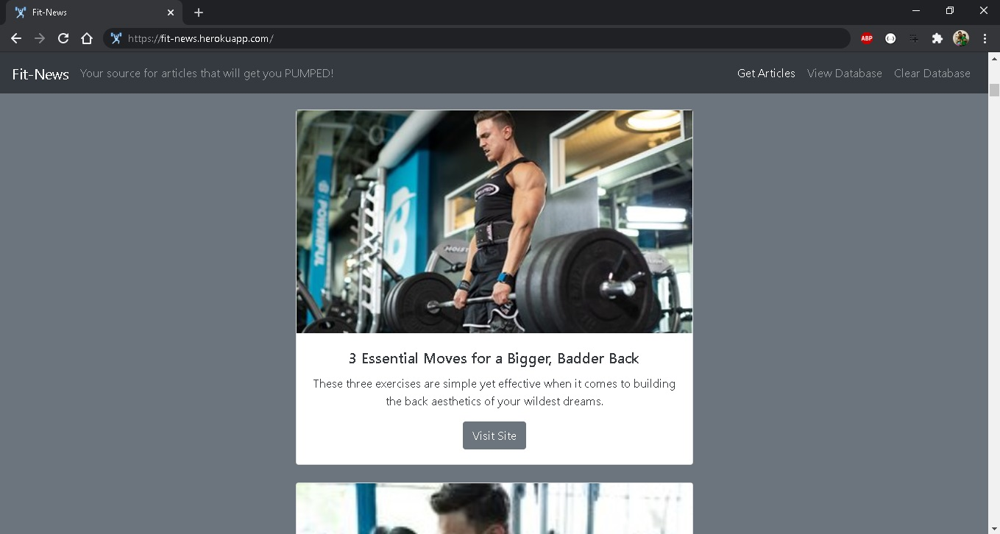

# Fit-News
Get the most recent news in the muscle and fitness world!

## Deployed on Heroku!
[Fit-News](https://fit-news.herokuapp.com/)

## Technologies Used:
Node.js, Express.js, MongoDB, Mongoose, HTML5, CSS3, and Bootstrap.

## Directories:
* Root
    * [app](./app/)
        * [models](./app/models/)
            * [article.js](./app/models/article.js)
            * [comments.js](./app/models/comments.js)
            * [index.js](./app/models/index.js)
        * [public](./app/public/)
            * [html](./app/public/html)
                * [index.html](./app/public/index.html)
            * [js](./app/public/js)
                * [app.js](./app/public/app.js)
        * [routes](./app/routes/)
            * [apiRoutes.js](./app/routes/apiRoutes.js)
            * [htmlRoutes.js](./app/routes/htmlRoutes.js)
    * [images](./app/public/images/)
    * [server.js](./server.js)

